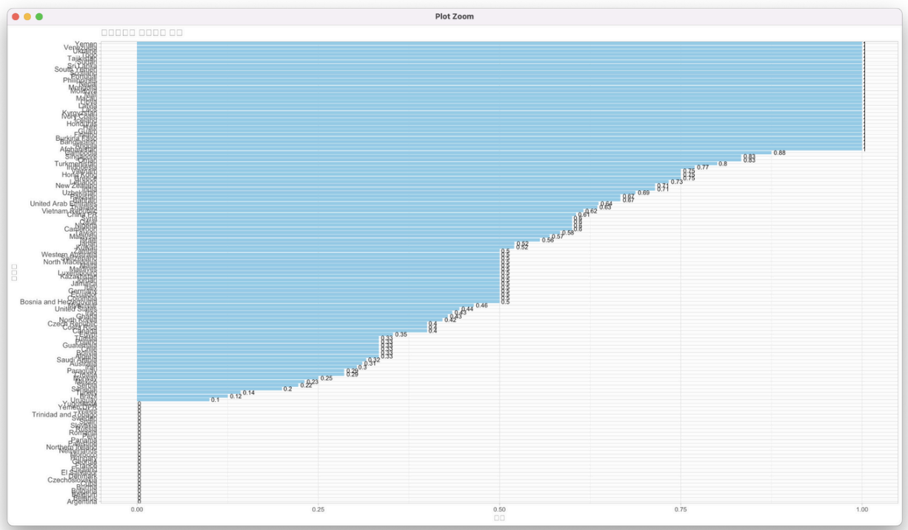

# 🇰🇷 KoreaMatchAnalysis

**Analyze South Korea's international football match data to extract insights on outcomes, win rates, and predictive modeling using KNN and SVM algorithms.**

---

## 🏆 Project Overview

This project analyzes South Korea's football matches to calculate win rates and predict match results using machine learning models.  
Two classification algorithms—K-Nearest Neighbors (KNN) and Support Vector Machines (SVM)—are applied to forecast whether South Korea will win, lose, or draw a game.

---

## 🛠️ Tech Stack

### Language  

### Libraries

| Package    | Description                          |
|------------|--------------------------------------|
| `dplyr`    | Data manipulation and filtering      |
| `caret`    | Model training and evaluation        |
| `e1071`    | SVM modeling                         |
| `ggplot2`  | Data visualization                   |

---

## 🔍 Main Features

### 1. Match Filtering for South Korea
- Extracts matches where South Korea is either the home or away team
- Aggregates the number of wins, draws, and losses against each opponent

### 2. Win Rate by Opponent
- Calculates South Korea’s win rate against each country
- Ranks opponents based on win percentage
- Visualizes win rates using bar plots

  

### 3. Match Outcome Prediction
- Applies KNN and SVM classifiers to predict results (Win / Draw / Loss)
- Evaluates model performance using confusion matrix, accuracy, and precision metrics

#### 📋 SVM Model Evaluation

- Text-based output from SVM model (e.g., confusion matrix, accuracy, sensitivity)

  

#### 🔥 SVM Confusion Matrix (Heatmap)

  

---

## 📊 Visual Comparisons

### Model Confusion Matrix (SVM Zoomed)

  

---

## 📈 Results Summary

| Model | Accuracy | Kappa | Balanced Accuracy |
|-------|----------|--------|-------------------|
| KNN   | 1.000    | 1.0    | 1.000             |
| SVM   | 1.000    | 1.0    | 1.000             |

> ⚠️ Note: Perfect accuracy may indicate potential overfitting or class imbalance. Additional validation is recommended.

